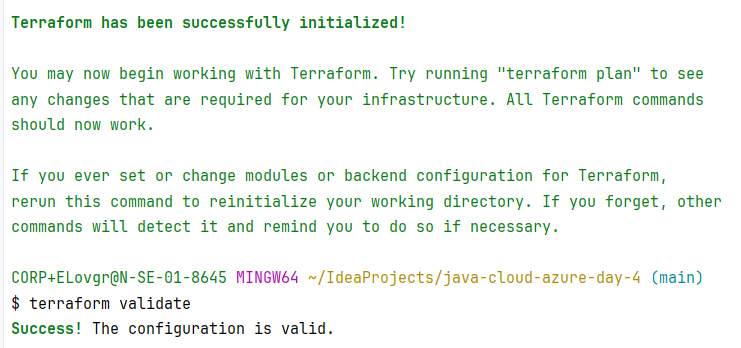
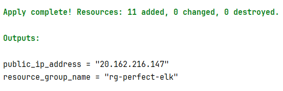
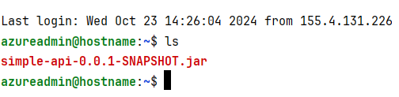
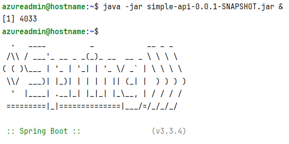
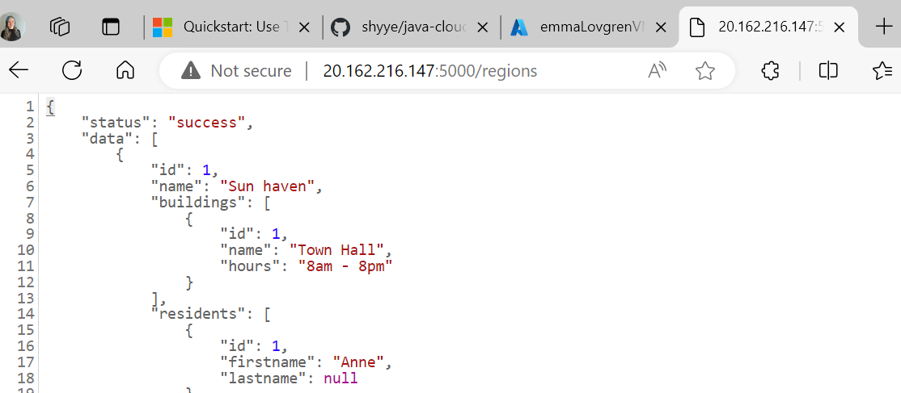
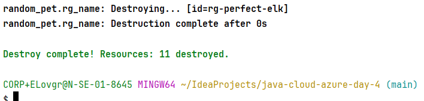

# Submission

1. Generated ssh key.
2. Changed 'my' to 'emmaLovgren' in `main.tf`.
3. Changed Ubuntu version and added security rules to `main.tf`.
4. Run `terraform init -upgrade`
5. Validate terraform

6. Generate main.tfplan and run apply command to create VM:

7. Run ./gradlew build in the IntelliJ project for the backend to update the jar file.
8. Install java on VM with `sudo apt install openjdk-21-jdk`
8. Copied the jar file to this repo and added the jar file to gitignore to avoid pushing it to GitHub `scp -i azure-tf-server simple-api-0.0.1-SNAPSHOT.jar azureadmin@20.162.216.147:/home/azureadmin
`:  

9. Run command `java -jar simple-api-0.0.1-SNAPSHOT.jar &` in VM:  

10. Opened in web browser `http://20.162.216.147:5000/regions`:  

11. Run `terraform destroy` to clean up and delete VM after this exercise:  
